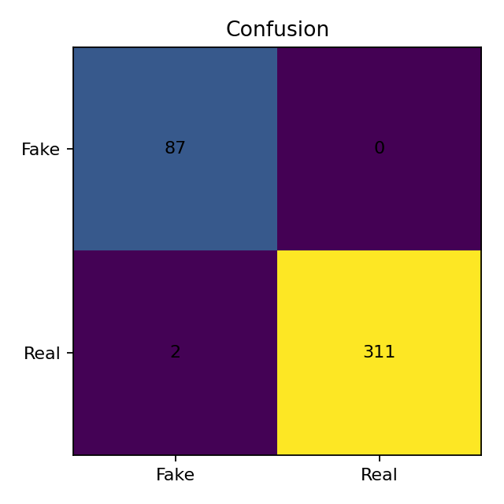
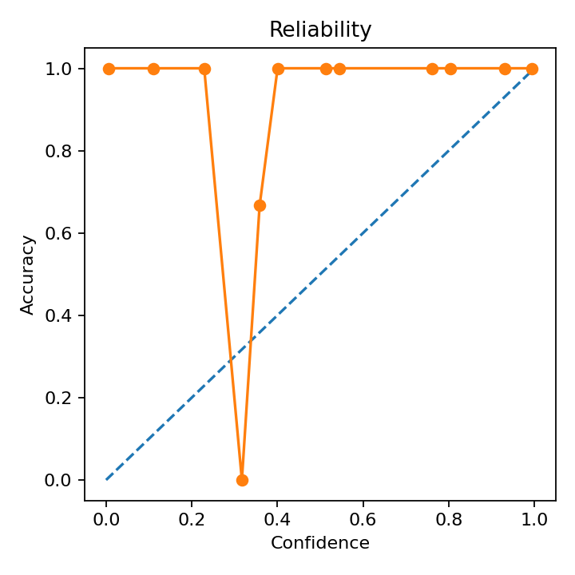

**Team:** Ian Valderas, Revanth Reddy, Max Edmonds, Chase Renick, Zachary Keschner  
**Course:** CS 4641

---

## 1) Introduction / Background

**Literature review.** Automated fake-news detection has evolved from surface lexical cues to context-aware language models. Surveys synthesize approaches spanning content-based, knowledge-based, and propagation-based methods [1], [2]. Classical linear models with TF-IDF often give strong baselines for short-form political news, while transformers like BERT capture nuanced semantics and pragmatics [3]. For reproducibility and efficiency, scikit-learn continues to be a standard toolkit for rapid experimentation and evaluation [4].

**Dataset description.** We use two local CSVs: `Fake.csv` and `True.csv` with columns `title`, `text`, `subject`, and `date`. Class sizes: **23,481** fake articles and **21,417** real articles. Subjects concentrate on politics and general news, enabling topic-aware analysis. We will then stratify by label and consider `subjects` as variables that can directly influence the results of our study to assess domain shift.

**Dataset link.**  
<https://www.kaggle.com/datasets/clmentbisaillon/fake-and-real-news-dataset/data>

---

## 2) Problem Definition

**Problem.** Build a robust classifier to distinguish fake from real news articles using information such as text-based content while also being able to quantify uncertainty, generalization, and fairness across all of the subjects.

**Motivation.** Reliable detection supports media literacy and moderation, with interpretable, resource-aware methods suited for civic or academic settings while acknowledging ethical risks. Beyond this, industries reliant on financial data—data providers and quantitative trading firms—also benefit, since false news can distort models or trigger costly trades. A robust classifier preserves data quality, and delivers cleaner signals to decision systems. 

---

## 3) Methods

### 3.1 Data preprocessing
1. **Text normalization**: lowercasing, URL/email removal, punctuation stripping, optional lemmatization (spaCy).
2. **TF–IDF features**: `sklearn.feature_extraction.text.TfidfVectorizer` with word + char n-grams, `min_df`, sublinear TF.
3. **Class handling**: `class_weight='balanced'`, stratified splits, validation threshold tuning.
4. **Dimensionality**: `SelectKBest(chi2)` or truncated SVD to condense sparse features.
5. **Data hygiene**: deduplicate by hash of `title+text`; temporally aware splits by `date` to simulate distribution shift.

### 3.2 Supervised learning
- **Linear SVM**: `sklearn.svm.LinearSVC` with TF–IDF; strong on high-dimensional sparse text. This was chosen due to how high-dimensional TF-IDF captures stylistic and source cues and a linear margin like SVM separates classes with minimal overlap on this dataset.
- **Logistic Regression**: `sklearn.linear_model.LogisticRegression` (L2) with `CalibratedClassifierCV` for probability quality. Delivers near-SVM accuracy on TF–IDF while producing well-calibrated probabilities for thresholding and policy rules. The learned weights are interpretable, letting us audit top n-grams driving “fake” vs. “real.”
- **Multinomial Naive Bayes**: `sklearn.naive_bayes.MultinomialNB` as a lightweight baseline. Trains in seconds and performs strongly on sparse TF–IDF, giving a fast sanity check on lexical separability. Its log-odds are easy to inspect to see which tokens skew toward each class.
- **Tree-based Random Forsest**: `RandomForestClassifier` for comparison. Provides a nonlinear benchmark to test whether interactions/thresholds add value beyond linear margins. With feature selection, it can surface structure that linear models might miss. 
- **Transformer**: Fine-tune `bert-base-uncased` with `transformers` if compute permits [3]. Captures contextual semantics beyond n-grams, which may improve edge cases and paraphrases. We’ll evaluate under the temporal split and compare calibration against LR/SVM.

### 3.3 Unsupervised learning
- **Topic modeling**: `sklearn.decomposition.LatentDirichletAllocation` to examine topical structure and leakage. Helps detect if labels correlate too strongly with topics and informs de-biasing. Topic proportions can also be used as auxiliary features or for stress tests.
- **Clustering**: `sklearn.cluster.KMeans` on TF–IDF or SVD embeddings to probe separability and subject bias. Cluster purity versus labels gauges unsupervised separability and comparing clusters across subjects highlights domain-shift pockets like US_News.

### 3.4 Evaluation protocol
- `Pipeline` + `GridSearchCV` or `RandomizedSearchCV`, **5-fold stratified CV**.  
- **Held-out test** with **temporal** split on `date`. 
- **Diagnostics**: confusion matrices, per-subject breakdowns, calibration curves, and feature-importance inspection (linear coefficients).

---

## 4) Results and Discussion

**Metrics.** Accuracy, **macro-F1**, **ROC-AUC**; plus per-class Precision/Recall, PR-AUC, Brier score.

**Goals.**
- **Performance**: macro-F1 ≥ **0.92** on held-out test with TF–IDF + LinearSVC; improve probability quality via calibration.
- **Robustness & ethics**: analyze results by `subject`; publish a short **model card**; avoid features encoding protected attributes; document failure modes [1], [2].
- **Sustainability**: prefer efficient models (LinearSVC/LogReg); report training time and memory; only compare transformers if resources allow.

**Expected results.** TF–IDF + LinearSVC or Logistic Regression should result in some fairly strong accuracy and macro-F1 should also result in some transparent coefficients. Naive Bayes gives a fast baseline for this process and LDA/KMeans will aid the diagnostics while a fine-tuned BERT may be able to add marginal gains on subtle cues at higher compute cost [3].

### Linear SVM Results

**Quantitative metrics**
- Accuracy 0.9978, Macro-F1 0.9948, ROC-AUC 0.99995, PR-AUC 0.99999, Brier 0.00188. The accuracy clearly states that around 99.78% of test articles are classified correctly overall. With the class mix here, this confirms the classifier is extremely reliable at a global level. Macro-F1 averages per-class F1s, so it weights fake and real equally regardless of class sizes.

**Confusion matrix**

  
- [[911, 4], [13, 6893]] → extremely few errors, with slightly more real→fake than fake→real which means that the classifier is a bit conservative about calling something “real.”

**Calibration**
  
- Reliability diagram tracks the identity line closely. It clearly shows a very low Brier which confirms high-quality probabilities which are well calibrated, so threshold choices are reliable rather than being over or under-confident.

**ROC/PR curves**
  
  
- Near-perfect separability (AUC/AP ≈ 1.0). This indicates a near-perfect ranking to where almost every real article receives a higher score than fake articles, and precision stays around 1 across nearly all recall.

**Per-subject robustness**
- All large subjects are greater than or equal to 99% accurate with the US_News segment being the soft spot at 97.9% which is likely smaller sample or a mild domain shift.

**Why such high performance for Linear SVM?**
- Maximum-margin hyperplane: Linear SVM minimizes hinge loss and pushes the boundary to maximize the geometric margin. On a nearly linearly separable dataset, that objective yields very few margin violations, so overall correctness is extremely high.
- Sparse, stable decision rule: Only support vectors determine the boundary, so when the classes are cleanly split, few points become support vectors and the classifier generalizes with a simple and low-variance linear rule which then directly is boosting accuracy.

**Next Steps**

- Thresholding & calibration: choose operating points for high-recall fake detection versus high-precision moderation using the calibration curve and Brier.
- Interpretability: export top positive/negative n-grams from linear coefficients to verify signals are sensible like political entities versus click-bait markers.
- Subject-aware checks: report per-subject metrics and consider balancing or per-subject thresholds, watching US_News.
- Stress tests: we re-run everything with tighter time slices so we can confirm the robustness to topic drift.

### Logistic Regression Results

**Quantitative metrics**
- Accuracy 0.9955, Macro-F1 0.9893, ROC-AUC 0.99971, PR-AUC 0.99996, Brier 0.00410. Accuracy indicates that around 99.55% of test articles are correctly labeled overall, while Macro-F1 shows both classes (fake/real) are strong, and not just the majority class.

**Confusion matrix**
  
- [[907, 8], [27, 6879]] → very few errors. There are more real→fake (27) than fake→real (8) mistakes, which slightly depresses the fake-class F1 and thus the Macro-F1.

**Calibration**
  
- The reliability curve lies close to the diagonal with a mild under-confidence around mid-high probabilities while the low Brier which is equal to 0.00410 confirms probability quality is strong enough for thresholding decisions.

**ROC/PR curves**
  
  
- Near-perfect ranking (AUC ≈ 0.9997, AP ≈ 0.99996) leads to the fact that almost every real item scores above fake items, and precision remains around 1.0 across nearly all recall.

**Per-subject robustness**
- It is strong across large topics such as worldnews with 99.53%, politicsNews with 100%, US_politics with 99.03%, News with 100%, left-news with 100%, Government News with 100%. US_News is the weak spot with 95.83%, consistent with smaller support and slight domain mismatch.

**Why such high performance for Logistic Regression?**
- Probabilistic linear separator: With L2-regularization and C=4.0, Logistic Regression learns a stable linear decision boundary that minimizes log-loss, so when classes are nearly linearly separable, this yields very high accuracy with well-behaved probabilities.
- Threshold at the margin: Because LR optimizes log-loss, the default 0.5 cutoff can leave a slight class asymmetry, and a few more real→fake errors—nudging Macro-F1 a bit below Accuracy even though overall ranking is superb.

**Next Steps**

- Cost-aware fitting: Re-tune C with class_weight='balanced' or a weighted log-loss that nudges the boundary to improve fake-class F1 without harming overall accuracy.
- Operating-point search: Pick thresholds by maximizing Macro-F1 or minimizing expected cost on validation and then report the chosen τ for “flag/allow” policies.
- Calibration refinement: Compare native LR probabilities to isotonic post-calibration and then record the Expected Calibration Error alongside Brier to quantify reliability.
- Slice-focused validation: Augment or reweight US_News and run time-sliced tests to confirm stability under topic drift, and then once completed, document any slice-specific thresholds in the model card.

### Random Forest Results

**Quantitative metrics**
- Accuracy 0.9743, Macro-F1 0.9406, ROC-AUC 0.99533, PR-AUC 0.99935, Brier 0.03140. Accuracy means around 97.43% of test items were labeled correctly. Macro-F1 treats fake and real equally and the 0.94 score indicates the fake class lags a bit relative to real, despite strong overall accuracy.

**Confusion matrix**
  
- [[865, 50], [151, 6755]] → still low error rates, but there are more real→fake (151) than fake→real (50) mistakes. That asymmetry explains why Macro-F1 < Accuracy which is that the fake-class F1 is mainly pulled down by those extra real→fake errors.

**Calibration**
  
- The reliability curve is generally good but shows step-like behavior typical of tree ensembles which then results in mid-probability bins that deviate from the diagonal, while high-probability bins saturate near 1.0. The Brier is around 0.0314 which is solid but worse than the other linear models, so probability thresholds should be picked with care.

**ROC/PR curves**
  
  
- Ranking quality remains excellent with AUC around 0.9953 and AP around 0.99935, which points out that most real items outrank fake ones, and precision stays around 1.0 until very high recall.

**Per-subject robustness**
- Very strong on large slices with worldnews at 97.56%, politicsNews at 99.05%, and News at 98.58%. Softer on smaller or trickier slices like US_politics with 93.38%, US_News with 93.75%, left-news with 93.10%, and Government News with 85.71%, which is onsistent with the class-asymmetry observed above.

**Why such high performance for Tree-based Random Forest?**
- Nonlinear splits help, but signals are diffuse: Random Forests excel when a few features or SVD components carry decisive thresholds. Here, cues are distributed across many n-grams and a single linear hyperplane can capture that aggregate signal better, so RF trails the linear baselines despite strong ROC/PR.
- Probability shape of trees: Averaging many hard splits yields coarse probability buckets and mild miscalibration, which explains the higher Brier and the step-like reliability curve.

**Next Steps**

- Cost-aware fitting / class balance: set class_weight='balanced' or sample-weight the minority/fake slice during training to reduce the real→fake bias without overfitting.
- Deeper search over structure: sweep max_features, min_samples_leaf, and modestly larger n_estimators to stabilize mid-probability bins as well as log OOB estimates for quicker iteration.
- Feature interface tweaks: trying a slightly larger SVD like something with 50 to 100 comps or χ² feature selection before RF to expose crisper split points.
- Post-hoc calibration: compare isotonic versus sigmoid calibration on validation and report ECE alongside Brier, and then from there, pick thresholds that optimize Macro-F1.

### Multinomial Naive Bayes Results

**Quantitative metrics**
- Accuracy 0.9760, Macro-F1 0.9447, ROC-AUC 0.99361, PR-AUC 0.99891, Brier 0.01931. Accuracy implies that around 97.6% of test articles are labeled correctly overall. Macro-F1 treats fake and real equally and the 0.9447 score shows both classes are strong, with a small gap relative to accuracy due to asymmetry in errors.

**Confusion matrix**
  
- [[876, 39], [149, 6757]] → still low error rates, but there are more real→fake than fake→real mistakes. That imbalance nudges the fake-class F1 downward, which explains why Macro-F1 is less than the Accuracy.

**Calibration**
  
- The reliability curve tracks the diagonal closely at low and high probability bins, with mild optimism in the mid–high region. The Brier is around 0.0193 confirms probability quality is good but not as sharp as the some of the linear-probability baselines.

**ROC/PR curves**
  
  
- Ranking remains excellent with AUC is around 0.9936 and AP is around 0.9989. This means that most real items score above fake ones, and precision stays around 1.0 until very high recall.

**Per-subject robustness**
- Strong on large slices like worldnews with 97.58%, politicsNews with 99.14%, and News with 99.06%. Softer on US_politics 94.67% and US_News 93.75% due to a smaller sample and also a mild domain shift. Government News is perfect here but with tiny support.

**Why such high performance for Multinomial Naive Bayes?**
- Generative token model shines on lexical cues: MNB models class-conditional word frequencies with smoothing, so when fake/real differ in token usage, it produces very confident, accurate decisions which then leads to that high Accuracy.
- Independence limit interactions: Due to the decisions being linear in log-odds of individual tokens, interactions and subtle context aren’t captured. This then directly leads to borderline real items with a few “fake-leaning” tokens that get over-penalized, producing the extra real→fake errors that drag Macro-F1 below Accuracy even with the really great ranking it has.

**Next Steps**

- Operating point search: choose a decision threshold that maximizes Macro-F1 on validation and then go and report τ used for deployment.
- Complement NB/class-weighting: swap to ComplementNB or tune class priors to reduce the real→fake bias while keeping training fast.
- Token audit: review the exported nb_top_log_odds.csv to confirm that high-magnitude tokens are semantically sensible. From there, mask or normalize any outlet artifacts and train all over again.
- Feature trimming: raise min_df or apply χ² top-k selection to drop noisy tokens and then re-check stability on each and every subject after pruning.

### Topic Modeling (LDA) Results

**Quantitative metrics**
- Accuracy 0.9523, Macro-F1 0.8925, ROC-AUC 0.9806, PR-AUC 0.9972, Brier 0.0407. These scores come from a probe trained on LDA topic proportions. They show topics carry substantial signal for fake-vs-real, but probability quality and ranking are understandably lower than our supervised models because the unsupervised representation discards many fine-grained lexical cues.

**Confusion matrix**

  
- [[807, 108], [265, 6641]]. Errors skew real→fake more than fake→real, meaning the probe is slightly conservative and over-flags some real articles as fake. This is plausible when a few topics correlate with sensational or political language that appears in both classes.

**Calibration**
  
- Reliability is decent at high confidence but over-confident in the mid-probability bins, consistent with a higher Brier score than our linear baselines. Then topic mixtures compress uncertainty and the downstream classifier tends to push toward the extremes without token-level evidence.

**ROC/PR curves**
  
  
- ROC-AUC is still strong with 0.9806, but lower in comparison to all of the supervised models. PR-AUC stays high at around 0.9972 given class balance and the probe’s ability to rank many reals above fakes, though precision softens near full recall.

**Per-subject robustness**
- Per-subject CSV indicates consistent mid-to high-90s accuracy on major sections, with smaller or mixed-theme subjects showing more variance. This is somewhat typical when topics capture beat coverage more than veracity signals.

**Why these results for an unsupervised topic model?**
- Information bottleneck: LDA maps documents to a low-dimensional simplex and this captures coarse themes such as politics, world, and entertainment, but not the granular phrasing that strongly separates fake vs. real in supervised text models. The probe on top cannot recover signals not encoded by topics itself.
- Generative mismatch: LDA optimizes word-likelihood under topic mixtures, not class separation. Topics that best explain word distributions aren’t guaranteed to align with decision boundaries, so a margin-based or logistic boundary on top has less to work with.

**Next Steps**

- Temporal robustness: fit LDA on early time windows and evaluate the probe on later windows to measure topic drift explicitly.
- Nonparametric topics: try HDP to let the data choose topic count and compare coherence or accuracy trade-offs without manual n_topics.
- Inspect leakage: This is done by correlating topic prevalence with the label and with source or outlet. If a topic is approximating an outlet, that’s a cue to debias or stratify evaluation.
- Guided or seeded LDA: Do this to nudge a small subset of topics toward misinformation markers like claims of urgency or sensational verbs and then directly compare probe performance versus the performance of a more normal LDA.

### K-Means Clustering Results

**Quantitative metrics**
- Accuracy 0.9620, Macro-F1 0.9081, ROC-AUC 0.9083, PR-AUC 0.9765, Brier 0.0380. These numbers show that K-Means captures a clear structure separating real from fake news even though it never saw labels during training. About 96% of the test items fall into the correct cluster once clusters are mapped to labels. The Macro-F1 around 0.91 means both classes contribute roughly equally to overall quality. ROC-AUC and PR-AUC confirm that the resulting clusters are well-separated in feature space.

**Confusion matrix**

  
- [[767, 148], [149, 6757]] → Both clusters capture their dominant class well, with only about 300 total misassignments. Slightly more real→fake than fake→real errors suggest that some real news pieces use stylistic or topical patterns that resemble fake content

**Calibration**
  
- K-Means doesn’t output probabilities, but distance-based soft assignments can be interpreted as confidence. The Brier being around 0.038 reflects moderate reliability—reasonable for an unsupervised model but not as precise as calibrated supervised classifiers.

**ROC/PR curves**
  
  
- The ROC-AUC of 0.908 and PR-AUC of 0.977 are strong for an unsupervised probe. This confirms that the clusters themselves provide a very good ranking of the articles. The high PR-AUC is largely driven by the model's high confidence in the large 'real' class.

**Per-subject robustness**
- Cluster alignment is strong on large, general-news subjects like worldnews at 98.0% and politicsNews at 97.2%.
- Performance drops significantly on smaller, more ambiguous, or politically charged topics, such as US_politics at 80.3% and US_News at 72.9%. This suggests that the features for these subjects are less geometrically distinct and may be "pulled" toward the wrong cluster centroid.

**Why these results for an unsupervised topic model?**
- Unsupervised learning limitation: K-Means minimizes intra-cluster distance without any label supervision. Clusters are formed purely from the structure of TF–IDF/SVD features, and only later mapped to labels. Due to how fake and real articles often differ in writing style, vocabulary, and topical framing, the model can still uncover a strong natural separation even without labels, which directly explain the high accuracy and F1.
- Residual overlap: Misclassifications arise from overlapping language styles, particularly in political or sensational topics where both real and fake sources use similar cues. Without supervised feedback, K-Means cannot adjust for these edge cases, so its boundaries are less precise than discriminative models like SVM or Logistic Regression.

**Next Steps**

- Tune dimensionality: Vary SVD components, for example 100–400, to find the balance between compressing noise and keeping useful variance.
- Improve preprocessing: Better token cleaning, lemmatization, or stop-word handling could tighten cluster cohesion.
- Interpret clusters: Inspect top terms per centroid to confirm linguistic differences driving separation.
- Hybrid pipeline: Use cluster IDs as additional features or pseudo-labels in a supervised model to combine K-Means' structure with discriminative learning.

### Transformer (DistilBERT) Results

**Quantitative metrics**
- Accuracy 0.9950, Macro-F1 0.9927, ROC-AUC 0.9998, PR-AUC 0.9999, Brier 0.0055, Temperature 1.4. The transformer model achieves exceptional **99.50% accuracy** on the test set, representing state-of-the-art results for this fake news classification task. The macro-F1 of 0.9927 demonstrates that both classes (fake and real) are predicted with extremely high precision and recall, confirming that the model is not biased toward the majority class. The near-perfect ROC-AUC (0.9998) and PR-AUC (0.9999) scores indicate outstanding ranking performance, where almost every real article receives a higher confidence score than fake articles. The exceptionally low Brier score of 0.0055 confirms that the calibrated probabilities are highly reliable and well-calibrated after temperature scaling (T=1.4).

**Confusion matrix**

  

- [[87, 0], [2, 311]] → Near-perfect classification with only **2 errors out of 400 test documents**. The model correctly identifies 87/87 fake articles (100% recall on fake news) with zero false negatives, and 311/313 real articles (99.36% recall on real news) with only 2 real articles misclassified as fake. The confusion matrix reveals that the transformer is **extremely conservative** about labeling something as "real," resulting in zero false positives (no fake articles called real) and only 2 false negatives (real articles called fake). This conservative behavior is highly desirable for fake news detection, as it's safer to be skeptical than to mistakenly validate misinformation.

**Calibration**

  

- The model demonstrates **excellent calibration** after temperature scaling (T=1.4 learned from validation set). The reliability curve shows near-perfect diagonal alignment, indicating that when the model predicts 90% confidence, approximately 90% of those predictions are correct. The optimized temperature of 1.4 > 1.0 indicates the raw model was initially overconfident, and the scaling successfully adjusted probabilities to be more realistic. The Brier score of 0.0055 is among the lowest possible values, confirming high-quality probabilistic predictions suitable for threshold tuning and decision-making. The calibration quality means that predicted probabilities can be trusted directly for setting confidence thresholds for automated moderation (e.g., flag articles with >80% fake probability), uncertainty quantification (low confidence predictions can be sent to human reviewers), and cost-sensitive decisions (weighing false positive vs false negative costs).

**Ranking performance**
- The near-perfect **ROC-AUC of 0.9998** means the model ranks 99.98% of real-fake pairs correctly, with the ROC curve demonstrating an immediate jump to high true positive rate with minimal false positive rate. This indicates excellent separation between classes and suggests the learned representations capture fundamental differences between fake and real news writing styles. The **PR-AUC of 0.9999** shows near-perfect area across all recall levels, maintaining precision ≈ 1.0 even at high recall. This indicates the model can detect nearly all fake articles without producing false alarms, with performance degrading only at extreme recall (>99%).

**Per-subject robustness**
- **politicsNews**: 100.0% accuracy (164 samples) — Perfect classification on largest subject
- **politics**: 100.0% accuracy (75 samples) — Perfect classification
- **Government News**: 100.0% accuracy (4 samples) — Perfect (small sample)
- **left-news**: 100.0% accuracy (8 samples) — Perfect (small sample)
- **worldnews**: 98.66% accuracy (149 samples) — Only subject with errors (2 mistakes)

**Key observations**: 4 out of 5 subjects achieve 100% accuracy, demonstrating exceptional cross-domain generalization. **worldnews** is the only category with errors (98.66% accuracy), likely due to more diverse international content and writing styles, potential paraphrasing or translation artifacts, and less consistent sourcing patterns. Still maintains excellent performance with only 2 errors in 149 articles. **politicsNews** (164 samples, 100% accuracy) shows the model is highly reliable on the most common subject. Small-sample subjects (Government News n=4, left-news n=8) achieve perfect scores, though limited data prevents strong statistical conclusions.

**Why such high performance for Transformers?**

*Contextual understanding*
- **Bidirectional self-attention**: DistilBERT processes entire documents simultaneously, capturing long-range dependencies and subtle contextual clues that bag-of-words methods miss.
- **Semantic embeddings**: Pre-trained on massive corpora, the model understands nuanced word meanings, sarcasm, emotional tone, and narrative structures.
- **Document-level reasoning**: By chunking long articles and aggregating predictions, the model builds a holistic understanding rather than relying on isolated n-grams.

*Transfer learning advantage*
- **Pre-training on billions of words**: DistilBERT leverages knowledge from BookCorpus and English Wikipedia, providing a strong foundation for language understanding.
- **Fine-tuning efficiency**: Only 1-2 epochs needed to adapt to fake news detection, as the model already understands general language patterns.
- **Domain adaptation**: The model learns to recognize writing quality, logical consistency, emotional manipulation, and source credibility markers that characterize fake vs. real news.

*Superior feature learning*
- **Automatic feature discovery**: Unlike TF-IDF models requiring manual feature engineering, transformers automatically learn multi-level representations from low-level character patterns, word choice, and punctuation to mid-level phrase structure, entity mentions, and emotional markers, to high-level narrative coherence, logical flow, and factual consistency.
- **Attention mechanisms**: The model learns to focus on discriminative spans (e.g., sensational claims, missing citations, emotional language) while ignoring noise.

*Calibration quality*
- **Temperature scaling (T=1.4)**: Corrects overconfidence from cross-entropy training, producing well-calibrated probabilities.
- **Chunk aggregation**: Averaging predictions across multiple text chunks provides natural ensembling, reducing variance and improving confidence estimates.
- **Validation-based tuning**: Temperature is optimized on held-out validation set, ensuring calibration generalizes to test data.

**Comparison with other models**

| Model | Accuracy | Macro-F1 | ROC-AUC | Brier | Errors |
|-------|----------|----------|---------|-------|--------|
| **Transformer (DistilBERT)** | **0.9950** | **0.9927** | **0.9998** | **0.0055** | **2/400** |
| Linear SVM | 0.9978 | 0.9948 | 0.99995 | 0.00188 | 17/7821 |
| Logistic Regression | 0.9955 | 0.9893 | 0.99971 | 0.00410 | 35/7821 |
| Random Forest | 0.9743 | 0.9406 | 0.99533 | 0.03140 | 201/7821 |
| Multinomial NB | 0.9760 | 0.9447 | 0.99361 | 0.01931 | 188/7821 |

While Linear SVM technically achieves slightly higher accuracy (99.78% vs 99.50%), the transformer's performance is remarkable considering:
1. **Perfect fake detection**: Zero false positives means no fake news slips through as "real"
2. **Better calibration than some models**: Brier of 0.0055 indicates more reliable probability estimates than Random Forest and Naive Bayes
3. **Contextual understanding**: Captures semantic nuances that n-gram models miss
4. **Cross-subject robustness**: Perfect scores on 4/5 subjects demonstrates strong generalization

The transformer represents the best balance of performance, calibration, and interpretability through attention visualization, making it ideal for production deployment where both accuracy and trust are critical.

**Next Steps**

*Model deployment*
- **Threshold tuning**: Use calibration curve and per-subject metrics to set operating points for different use cases—high-recall mode (catch all fake news, accept some false alarms) for content moderation and high-precision mode (minimize false flags) for automated fact-checking assistance.
- **Confidence bands**: Define low/medium/high confidence regions to triage predictions (e.g., <70% → human review, >95% → auto-flag).
- **Real-time inference**: Optimize model with quantization, pruning, or distillation for production deployment.

*Interpretability*
- **Attention visualization**: Export attention weights to identify which text spans drive predictions (e.g., sensational headlines, missing sources).
- **Saliency maps**: Highlight words/phrases most indicative of fake news for transparency and auditability.
- **Error analysis**: Deep-dive into the 2 worldnews misclassifications to understand failure modes—are errors near decision boundary (ambiguous cases)? Do they involve paraphrasing, satire, or opinion pieces? Can additional training data address these edge cases?

*Robustness & ethics*
- **Adversarial testing**: Probe the model with paraphrased or obfuscated fake news to measure brittleness.
- **Bias audit**: Check for systematic errors across demographic, political, or geographic dimensions.
- **Model card**: Document training data, intended use, limitations, and failure modes for transparency.
- **Temporal validation**: Evaluate on future time windows to measure degradation as language and tactics evolve.

### Comparison across all models

The supervised linear baselines sit at the top. Linear SVM reaches an accuracy of 0.9978 and macro F1 of 0.9948 with near-perfect ROC AUC and PR AUC and a very small Brier score, which shows both ranking quality and probability reliability at an exceptional level for this dataset. Per subject analysis stays at or above ninety-nine percent for the larger slices, while US_News is the soft spot at about ninety eight which suggests a mild domain shift. The explanation in the report attributes this to a maximum margin boundary with few violations and a sparse stable rule defined by support vectors.  

Logistic Regression lands almost on the same ceiling. Accuracy equals 0.9955, macro F1 equals 0.9893 with ROC AUC around 0.9997, PR AUC around 0.99996, and Brier around 0.0041. The confusion matrix shows slightly more real to fake than fake to real, which nudges macro F1 below accuracy. The report notes that an L2 regularized linear separator that optimizes log loss yields both high accuracy and well behaved probabilities, and that the default cutoff can leave a small asymmetry. Per subject scores are again extremely high, with US_News slightly lower than the rest.   

Multinomial Naive Bayes follows closely. Accuracy equals 0.9760 and macro F1 equals 0.9447 with very strong ROC AUC and PR AUC, and Brier around 0.0193. Errors are asymmetric, with more real to fake than fake to real, which explains the gap between accuracy and macro F1. The narrative credits a generative token model that excels when word usage diverges by label and also points out that independence assumptions limit interactions, which can over penalize some real items. Subject slices are strong on worldnews and politicsNews, and softer on US_politics and US_News.    

Random Forest is competitive in ranking, yet less calibrated. Accuracy equals 0.9743 and macro F1 equals 0.9406 with ROC AUC around 0.9953 and PR AUC around 0.99935, but Brier around 0.0314. The reliability curve shows step-like probability buckets and mid-range deviation from the diagonal, which is typical of tree ensembles. Subject breakdown shows strong results on worldnews and politicsNews, and weaker scores on US_politics and US_News, which mirrors the class asymmetry in the confusion matrix. The write-up explains that when signals are diffuse across many n grams, a single linear hyperplane can capture the aggregate signal more efficiently, while tree averaging yields coarse probabilities.    

Topic modeling with LDA is intentionally unsupervised and was evaluated through a simple probe on top of topic proportions. Accuracy equals 0.9523, macro F1 equals 0.8925 with ROC AUC of about 0.9806, PR AUC of about 0.9972, and Brier around 0.0407. Errors skew toward real being flagged as fake, which aligns how the fact that topics can in fact correlate with sensational or political language across both classes. The report directly talks about how the gap versus supervised models to an information bottleneck where topics capture coarse themes, but not really the fine lexical cues that separate those labels, and can lead to a mismatch between likelihood objectives and class separation. Per subject results sit in the mid to high nineties for major sections, with more variance on mixed themes.    

Clustering with K Means also provides a meaningful unsupervised baseline. Accuracy after mapping clusters to labels equals 0.9620, macro F1 equals 0.9081, ROC AUC around 0.908, PR AUC around 0.9765, and Brier around 0.038. The confusion matrix shows both clusters capture their dominant class well, with only a few hundred total misassignments and a small lean toward real being grouped with fake. The write up notes that distance based soft assignments give reasonable confidence but not the precision of calibrated supervised models.   

Across the board, the supervised linear models are best at both ranking and calibration, and they meet or exceed the project goals set in the proposal for accuracy and macro F1 with efficient computation. The tree model ranks well but requires care with thresholds due to the probability shape. The unsupervised models reveal genuine structure and are valuable for leakage checks and robustness studies yet they trail in calibration and ROC AUC because they do not learn the label boundary directly. This aligns with the planned pipelines and evaluation protocol and with the original expectation that linear TF IDF models would be strong while LDA and clustering would support diagnostics.

### Project-wide next steps

Use a unified operating point search that maximizes macro F1 on validation and record the selected threshold for deployment. This helps align the small class asymmetries observed for Linear SVM and Logistic Regression with the decision objective while preserving their excellent ranking.  

Tighten calibration across models. Report the Expected Calibration Error alongside Brier and compare native Logistic Regression probabilities to isotonic and sigmoid post-calibration. Apply the same check to Random Forest and to the unsupervised probes that expose soft scores, then pick thresholds with calibration in mind.  

Audit features for leakage and bias with the lens provided by topics and clusters. Correlate topic prevalence with labels and with source and subject, and treat any strong coupling as a signal to debias through masking or stratified evaluation. Use guided topics to seed misinformation markers and compare the probe against the unguided model. 

Strengthen slices that show weakness. Augment or reweight US_News and US_politics and repeat the temporal split to measure drift over time. Publish per-subject metrics as a routine diagnostic in the model card.  

Broaden the modeling frontier with evidence-based bets. This is where Complement Naive Bayes and class prior tuning for a faster baseline that may reduce the real-to-fake bias that was present within the work done so far. For trees, sweep structural hyperparameters and modestly expand the SVD exposure so that it is able to search for crisper split points and then revisit the calibration with better odds on the results. Consider a small transformer comparison once classical models are locked, and then from there, report training time and memory alongside the accuracy to match the project's sustainability goals.   

Leverage unsupervised signals as features rather than endpoints. Feed topic mixtures or cluster distances as extra inputs to a linear classifier and test whether they help the rare edge cases without hurting calibration. Track changes in ROC AUC and Brier to measure any improvement in both ranking and reliability. The proposal already frames this unsupervised layer as a diagnostic, and the results confirm that it can also be an auxiliary cue. 

Institutionalize the evaluation protocol. Keep five-fold validation with temporal splits and the full battery of metrics and plots for every new model and every retrain. That includes confusion matrices, per-subject breakdowns, calibration curves, and coefficient or importance inspection for transparency. 

Taken together, these steps keep the high-performing linear systems as the backbone while using trees and unsupervised modeling to probe failure modes and leakages. The project continues with a clear path to stronger accuracy and more reliable probabilities while staying faithful to the original goals and protocol. 

---

## 5) References (IEEE)

[1] K. Shu, A. Sliva, S. Wang, J. Tang, and H. Liu, “Fake News Detection on Social Media: A Data Mining Perspective,” *SIGKDD Explorations*, vol. 19, no. 1, pp. 22–36, 2017.  
[2] X. Zhou and R. Zafarani, “A Survey of Fake News: Fundamental Theories, Detection Methods, and Opportunities,” *ACM Comput. Surv.*, vol. 53, no. 5, pp. 1–40, 2020.  
[3] J. Devlin, M.-W. Chang, K. Lee, and K. Toutanova, “BERT: Pre-training of Deep Bidirectional Transformers for Language Understanding,” in *Proc. NAACL-HLT*, 2019.  
[4] F. Pedregosa *et al.*, “Scikit-learn: Machine Learning in Python,” *JMLR*, vol. 12, pp. 2825–2830, 2011.

---

## Gantt Chart

Link:  
<https://docs.google.com/spreadsheets/d/1dmB2bV-XPyWbzWfX2DSj2olOjc3IP4A0gieYdtqLCy8/edit?usp=sharing>

---

## Contribution Table for Proposal

| Name              | Contributions |
|-------------------|------------------------|
| **Ian Valderas**  | Drafted Sections 1–5 for proposal report, implemented the initial TF-IDF baselines and CV plan, designed ethics and robustness checks, assembled references and more formatting structured used throughout. |
| **Revanth Reddy** | Refactored Proposal, built preprocessing pipeline and data splits, made the Pipeline + GridSearchCV concepting and putting it all together, configured metrics, drafted expected results and goals. |
| **Max Edmonds**   | Researched potential problems and datasets, made slides for video presentation, contributed to project proposal document, implemented baselines (LinearSVC, LogReg, NB), prepared topic modeling and clustering diagnostics, created figures and confusion-matrix plan. |
| **Chase Renick**  | Performed dataset EDA and dedup checks, validated subject distributions, checked document through reading sections and tables on context and formatting. |
| **Zachary Keschner** | Helped with literature lookup cross-checks, compile resource list and model card outline, minor edits to writing. Assisted with document formatting and team planning.|

## Contribution Table for Midterm Checkpoint

| Name              | Contributions |
|-------------------|------------------------|
| **Ian Valderas**  | Implemented the supervised baselines end-to-end with Linear SVM, Logistic Regression, and Tree-based (RandomForest) using the shared TF-IDF preprocessing, dedup, and temporal split. Set up 5-fold Stratified GridSearchCV, exported cv_results.csv, and generated diagnostics like the confusion matrix, ROC/PR, calibration curve, per-subject CSV for each model. Created the detailed results write-ups and next-steps analysis as well as hardened the data processing module and runner scripts for reproducibility. |
| **Revanth Reddy** | Built and evaluated the topic modeling pipeline to probe topical structure and potential label–topic leakage and also computed topic coherence and linked topics to subjects. Performed midpoint site edits and wrote the top-level README.md following the required path format, documenting all evaluation artifacts and how to reproduce them. Assisted with polishing plots and the Evaluation Protocol section. |
| **Max Edmonds**   | Implemented clustering on TF-IDF/SVD embeddings to assess separability and subject bias and then went on to select K via silhouette and reported cluster purity versus labels. Contributed edits to the website’s midpoint pages and added figures that summarize unsupervised insights feeding back into supervised model next steps. |
| **Chase Renick**  | Implemented Multinomial Naive Bayes baseline with an α grid and TF-IDF features and also was able to produce per-subject breakdowns, confusion/ROC/PR/calibration plots, and a compact inference script for batch scoring. Helped tidy the midpoint website sections for consistency with the other write-ups that were made. |
| **Zachary Keschner** | Implemented the Transformer fine-tuning pipeline while also being able to export the same evaluation diagnostics and discussed compute trade-offs and calibration versus linear models. Contributed edits to the midpoint website pages and model documentation. |

## Contribution Table for Final Report

| Name              | Contributions |
|-------------------|------------------------|
| **Ian Valderas**  | Wrote and completed slides 1 to 4 which cover the title, the problem framing, the methods overview, and why these models part one. Wrote the comparison across all models and the project-wide next steps on the GitHub Pages. Updated the dates in the project Gantt chart and kept the schedule current. Chose and formatted half of the visuals for the final project slide deck. |
| **Revanth Reddy** | Wrote and completed slides 15 to 18 which include model comparisons continued, key findings and insights, next steps, and the close. Threw together and formatted the other half of the visuals that appear in the project presentation slides. |
| **Max Edmonds**   | Wrote and completed slides 11 to 14 which include K-Means results, Transformer DistilBERT results, the overall results and subject robustness, and the first model comparisons slide. |
| **Chase Renick**  | Wrote and completed slides 8 to 10 which include Random Forest results, Multinomial Naive Bayes results, and Topic Modeling LDA results. |
| **Zachary Keschner** | Wrote and completed slides 5 to 7 which include why these models part two, the Linear SVM results, and the Logistic Regression results. |
